# 📨 Assinatura Outlook

Script para realizar a configuração automática da assinatura de e-mail para o Outlook clássico e o Outlook WEB 

_____________________________________________________________________________

## ✨ Visão Geral

Esta automatização opera em PowerShell para realizar a configuração da assinatura no software do Outlook clássico e também para o Outlook WEB, idealizado para utilizar via Objeto de Politica de Grupo (GPO) no logon. 

1. O usuário autentica na maquina.
2. O script consulta as informações no AD do usuário autenticado na maquina.
3. Formata as informações do usuário para HTML e texto puro.
4. Assim inserindo o HTML e texto puro no Outlook clássico, e o HTML no Outlook WEB 

## ✅ Requisitos

- MS Entrar (necessário o registro de aplicativo para autenticação no Outlook WEB para aplicar a assinatura https://learn.microsoft.com/pt-br/entra/identity-platform/quickstart-register-app). 
- Outlook (app instalado no computador ou Outlook WEB).
- Modulo PowerShell ExchangeOnlineManagement (para realizar a conexão no Outlook WEB https://www.powershellgallery.com/packages/exchangeonlinemanagement/3.6.0).
- Permissão de leitura no Registro do usuário (`HKCU`).  
- Permissão de escrita em `%AppData%/Microsoft/Signatures`.

## ⚙️ Configuração

### Variáveis.

- `$ModulePath` local de localização do modulo ExchangeOnlineManagement.
- `$AppId` ID do cliente da Microsoft.
- `$TenantId` ID do Tenant da Microsoft.
- `$ClientSecret` Senha do cliente da Microsoft.
- `Organization` Nome do seu Tenant
- `$signatureEmail` local da arquivo modelo da assinatura.
- `$imageURL` Url da imagem da logo da empresa.
- `$imagemInstagram` Url da imagem do Instagram. 
- `$imagemFacebook` Url da imagem do Facebook. 
- `$imagemBase64Logo` logo da empresa em base64.
- `$imagemBase64Instagram` logo do Instagram em base64.
- `$imagemBase64Facebook` logo do Facebook em base64.

### Modulo ExchangeOnlineManagement

Para não instalar os modulos ExchangeOnlineManagement nos computadores, baixe o modulo e descompacte modulo baixado.

Para descompactar basta alterar a extensão ".nupkg" para ".zip"

### Imagens em base 64

Execute o script para converter a imagem em base 64 para alterar os campos no script 

```pwsh
	.\converterImgBase64.ps1
```

Altere o `$imagePath` para o caminha na imagem que deseja converter para base 64

Obs.: Realizo a conversão direto para base 64 e incluo no script, para não precisar buscar a imagem e converter.

### GPO

Configure o arquivo `RunAssinaturaEmail.bat` para ser executado no logon do usuário.

## � Opcionais

### Atributos adicionais 

1. O script existe alguns atributos do usuário que por padrão não existe no usuário, que são: 
	- camposAssinatura
	- assinaturaIngles - para quando for necessário alterar o nomes do HTML para ingles;
	- nomeAlternativo - para quando for necessário que um nome diferente seja mostrado ao invés do atributo displayname; 
	- ativarCargoAssinatura - para quando for necessário a apresentação do cargo na assinatura. 
	- bannerAssinatura - para quando for necessário que seja mostrado um banner abaixo das informações do usuário. 
	- bannerURLAssinatura - para quando for necessário que seja mostrado um banner abaixo das informações do usuário. 

Esses atributos foram criados para atender as necessidades da empresa para o qual foi solicitado. 

Para criação de novos atributos no Active Directory: 

Por padrão a engine Schema não vem instalada. Dessa forma é necessário carregar a dll executando no cmd o comando conforme abaixo:
```pwsh
	regsvr32 schmmgmt.dll
```


Será exibida uma mensagem de confirmação. Clique OK para fechar a mensagem.

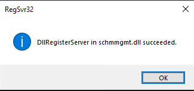

Vá até o menu Iniciar o execute o programa MMC como administrador.

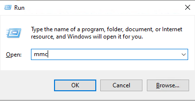

Na janela de se abriu vá até File e depois selecione a opção Add and Remove Snap-In.

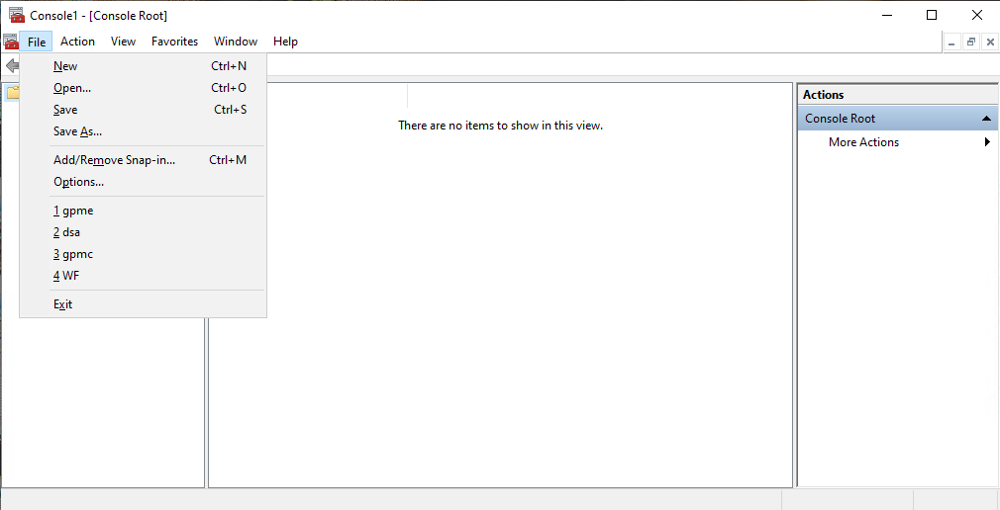

Selecione Active Directory Schema e clique em Add, após isso clicar em OK

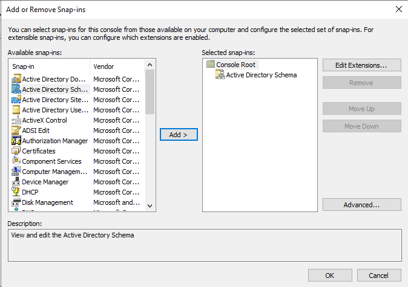

Para a criação de um novo atributo é necessário que saibamos qual OID está sendo utilizado pelo ambiente. Para isso copie o código vbs abaixo no notepad e salve no desktop como OID.vbs. Localize a variável “outFile=” e altere para o local onde deseja salvar o arquivo que deseja que seja criado. logo após executar o VBS.

```pwsh
	.\oidgen.vbs
```

Será gerada o arquivo conforme imagem abaixo:

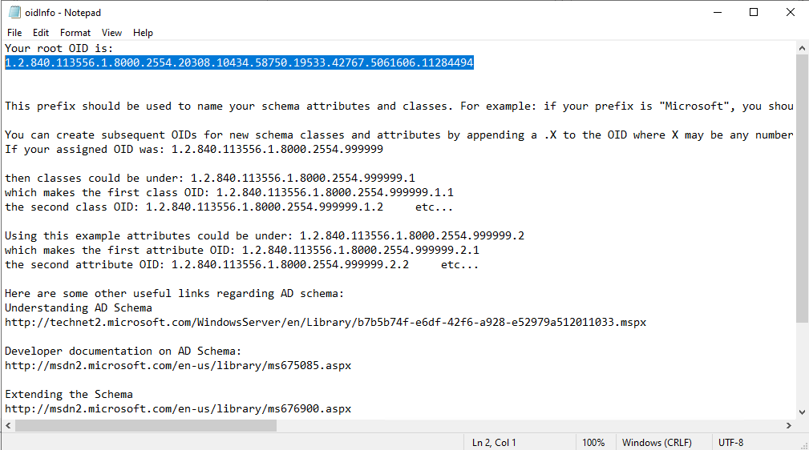

#### Criação de vínculo com o atributo.
Na console MCC selecione a opção Attribute e depois Create Attribute.

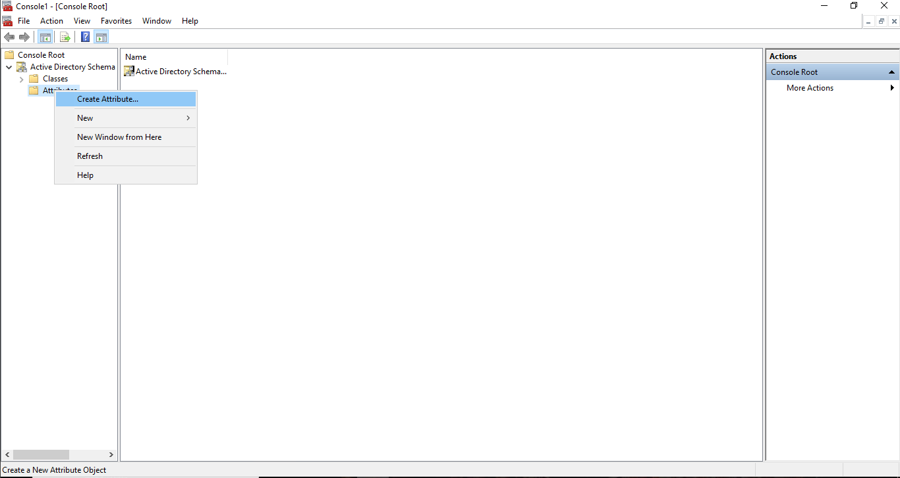

Um aviso é exibido neste ponto porque esses tipos de alterações se tornarão permanentes no Active Directory.
Certifique-se de ler e entender completamente o aviso, pois você não poderá excluir essas atualizações.

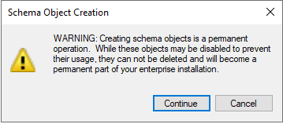

Se você clicar em continuar, você será solicitado a fornecer as seguintes informações:

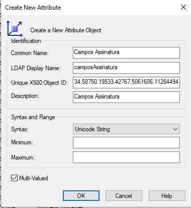

| Campo | Propósito | Necessário? | Anotações |
| `Nome Comum` | Nome do atributo que está sendo criado. \n \n Isso não pode ser alterado. | ✔ |  |
| `Nome de exibição LDAP` | Usado para verificar o atributo em pesquisas LDAP. | ✔ | Preenchido automaticamente por Nome Comum. |
| `ID de objeto X500 exclusivo` | Deve começar com0.,1. ou2. | ✔ | Esse script pode ser usado para gerar um ID de objeto apropriado |
| `Descrição` | Descrição do atributo. | × |  |
| `Sintaxe` | Formato do Atributo. | ✔ | Unicode String é recomendado como a opção padrão. |
| `Mínimo` | Um número mínimo de entradas é necessário para aplicar o atributo a uma conta. | × | Recomendado o uso de um valor binário (64.128 ou 256). |
| `Máximo` | Um número máximo de entradas que podem ser armazenadas. | × | Recomendado o uso de um valor binário (64.128 ou 256). |
| `Multivalorado` | Altera o atributo para permitir que ele aceite vários valores. | × | Não recomendado para uso com Produtos Exclaimer. |


Localize o atributo criado para habilitar a replicação de Catálogo Global e adicionar um novo atributo à Classe de Usuário:

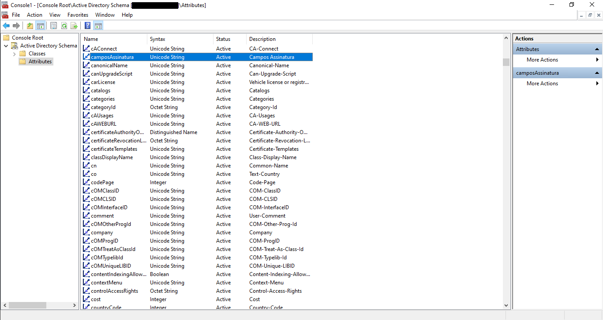

Selecione “Replicate this atribute to the Global Catalog” para habilitar a replicação para o Catálogo Global. Clique em OK para continuar.

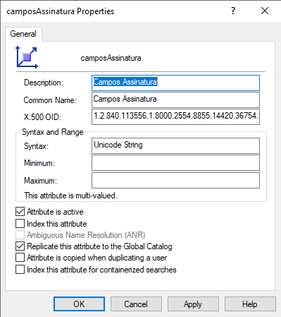

Em seguida, você precisará atribuir o atributo criado à classe de “User” para que ele fique disponível no Editor de Atributos.
No painel esquerdo do console, expanda a pasta Classes, localize a classe de usuário, clique com o botão direito do mouse e selecione Propriedades. A janela Propriedades do usuário é exibida.

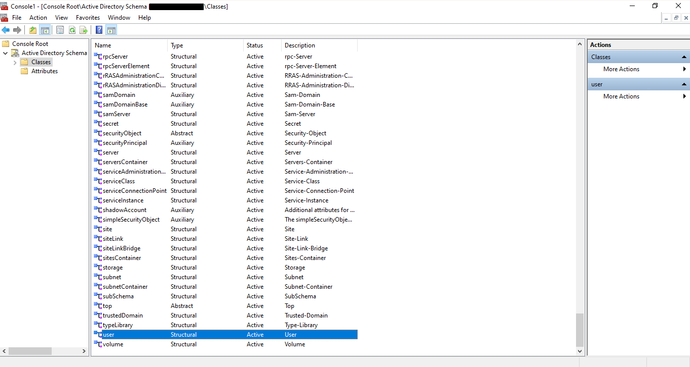

Abra a guia Atributos e clique em Add...

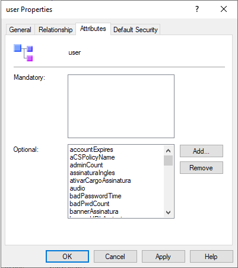

Procure o nome do seu novo atributo, realce e clique em OK.

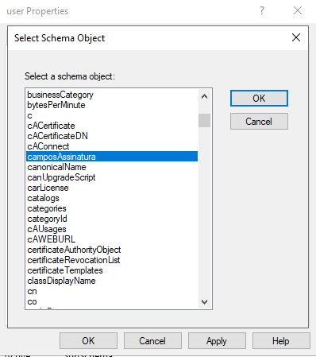

Clique em OK Novamente


Aviso: Essas alterações podem levar alguns minutos para entrar em vigor no Active Directory.

Aguarde 15 minutos para garantir que esses campos fiquem disponíveis, após o que você poderá atualizar os dados desse novo campo na guia Editor de Atributos de uma entrada do Active Directory de usuários. 

Abra o console Active Directory Users and Computers. Navegue até View e depois selecione a opção Advanced Features.

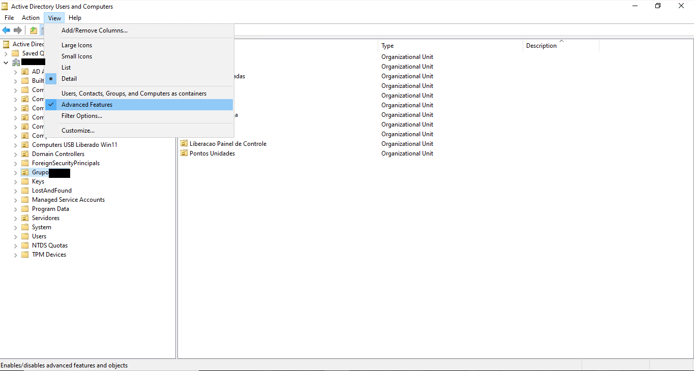

Navegue até OU Users, selecione um usuário qualquer e com o botão direito selecione a opção Properties. Navegue até a guia Attribute Editor e confirme que o valor é apresentado.

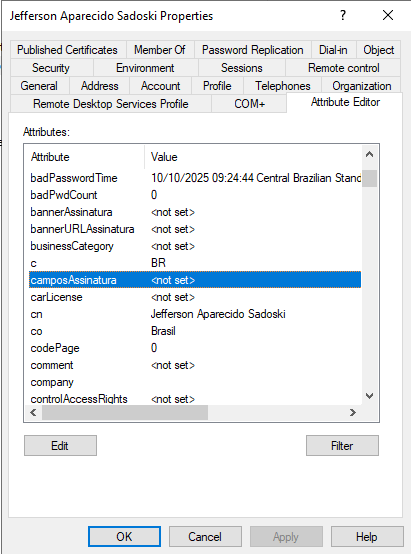


Assinatura finalizada.


